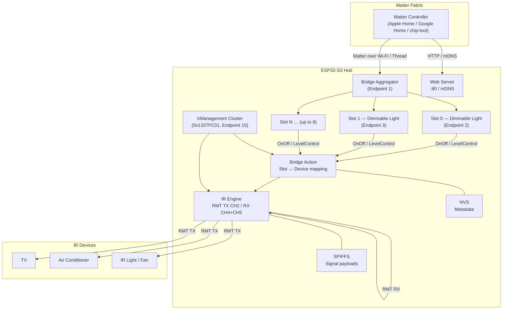

<div align="center">

<h1><b>esp-matter-hub</b></h1>
<p><b>ESP32 Matter bridge with IR blaster — control legacy IR devices from Apple Home, Google Home, or any Matter controller.</b></p>

<p>
  <a href="#features"><strong>Features</strong></a> ·
  <a href="#supported-hardware"><strong>Hardware</strong></a> ·
  <a href="#getting-started"><strong>Getting Started</strong></a> ·
  <a href="#architecture"><strong>Architecture</strong></a> ·
  <a href="#ir-management-cluster"><strong>IR Cluster</strong></a>
</p>

<p>

[](https://isocpp.org/)
[](https://docs.espressif.com/projects/esp-idf/)
[](https://buildwithmatter.com/)
[](https://creativecommons.org/publicdomain/zero/1.0/)

</p>

</div>

---

## Overview

`esp-matter-hub` is a firmware project that turns an ESP32 board into a **Matter bridge** for IR-controlled devices (TVs, air conditioners, lights, fans). Legacy appliances appear as native **dimmable light** endpoints inside Apple Home or any Matter-compatible ecosystem — no cloud, no proprietary app required.

The hub exposes up to **8 bridge slots**, each mappable to a registered IR device. A custom Matter cluster (`IrManagement`, cluster ID `0x1337FC01`) handles IR signal learning, storage, and slot wiring entirely over the Matter data model.

---

## Features

<details>
<summary><b>Matter Bridge</b></summary>

- Presents up to 8 bridged `dimmable_light` endpoints via a Matter Aggregator
- Works with Apple Home, Google Home, Amazon Alexa, and chip-tool
- BLE commissioning with DNS-SD re-advertisement after Wi-Fi connection
- Multi-fabric support — commission to several ecosystems simultaneously
- OTA update support (plain and AES-encrypted images) via `esp_matter_ota`
- NodeLabel sync: slot display names reflect device names in the Home app in real time

</details>

<details>
<summary><b>IR Engine (RMT-based)</b></summary>

- Captures IR signals via 2 RX channels (RMT CH4, CH5) with quality scoring
- Transmits learned signals via 1 TX channel (RMT CH2)
- Stores signals with name, device type, carrier frequency, and repeat count
- Per-slot binding of `on`, `off`, `level_up`, `level_down` signal IDs
- Level control maps brightness direction to up/down IR commands; brightness 0 triggers off signal
- Signal payload stored in SPIFFS (4.8 MB partition); NVS holds metadata

</details>

<details>
<summary><b>IrManagement Custom Cluster (0x1337FC01)</b></summary>

- Fully replaces the HTTP REST API surface over the Matter data model
- Commands: `StartLearning`, `CancelLearning`, `SaveSignal`, `DeleteSignal`, `SendSignal`, `AssignSignalToDev`, `RegisterDevice`, `RenameDevice`, `AssignDeviceToSlot`, `OpenCommissioning`, `GetSignalPayload`
- Attributes: `LearnState`, `LearnedPayload`, `SavedSignalsList`, `SlotAssignments`, `RegisteredDevices`, `SignalPayloadData`
- Event: `LearningCompleted` emitted when capture finishes
- Controllable via `chip-tool` using `hub_api.sh` wrapper

</details>

<details>
<summary><b>PSRAM Optimization (ESP32-S3 N16R8)</b></summary>

- 16 MB Flash, 8 MB Octal PSRAM at 80 MHz
- Matter, NimBLE, and CHIP heap allocations routed to external PSRAM to avoid internal heap pressure during commissioning
- Custom 16 MB partition table with dual OTA slots (5 MB each) and 4.8 MB SPIFFS storage

</details>

---

## Supported Hardware

| Chip | Wi-Fi | Thread | Tested | Notes |
|------|-------|--------|--------|-------|
| ESP32-S3 | Yes | — | Yes | Primary target; N16R8 variant with PSRAM recommended |
| ESP32-C6 | Yes | Yes | Yes | Thread + Wi-Fi dual-interface supported |
| ESP32-C5 | Yes | Yes | Yes | Thread + Wi-Fi dual-interface supported |
| ESP32-H2 | — | Yes | Yes | Thread-only; no Wi-Fi |
| ESP32-C3 | Yes | — | Config | sdkconfig provided, not actively tested |
| ESP32-C2 | Yes | — | Config | sdkconfig provided; relinker applied for size |

> [!NOTE]
> The default `sdkconfig.defaults` targets ESP32-S3 with PSRAM. For other chips, pass the chip-specific defaults file during build: `idf.py -D SDKCONFIG_DEFAULTS="sdkconfig.defaults;sdkconfig.defaults.esp32c6" ...`

---

## Tech Stack

| Layer | Technology |
|-------|-----------|
| RTOS | [FreeRTOS](https://www.freertos.org/) (via ESP-IDF) |
| Framework | [ESP-IDF v5.2.1](https://docs.espressif.com/projects/esp-idf/) |
| Matter SDK | [esp-matter](https://github.com/espressif/esp-matter) (connectedhomeip) |
| IR hardware | ESP RMT peripheral (1 TX + 2 RX channels) |
| Networking | LwIP, NimBLE, mDNS |
| Storage | NVS (metadata) + SPIFFS (signal payloads) |
| Language | C / C++ (GNU++17) |
| Build | CMake via `idf.py` |

---

## Architecture



**Data flow for a HomeKit "turn on" command:**

1. Matter controller sends `OnOff.On` to bridge slot endpoint.
2. `app_attribute_update_cb` dispatches to `bridge_action_execute`.
3. Bridge action looks up the slot's `on_signal_id` and calls `ir_engine_send_signal`.
4. IR engine transmits the stored RMT waveform via the TX channel.

---

## IR Management Cluster

The custom cluster (vendor prefix `0x1337`, cluster `0xFC01`) exposes IR functionality natively over Matter, making the HTTP REST API optional.

**Learn a new signal via chip-tool:**

```bash
# Start learning (10 second timeout)
./hub_api.sh start-learning 10000

# Point your remote at the IR receiver and press the button.
# Poll until state == READY
./hub_api.sh read-learn-state

# Commit with a name
./hub_api.sh save-signal "tv-power" "tv"

# Assign to slot 0 (on/off/level-up/level-down signal IDs)
./hub_api.sh assign-device-to-slot 0 <device_id>
```

**Send a stored signal on demand:**

```bash
./hub_api.sh send-signal <signal_id>
```

> [!TIP]
> `hub_api.sh` wraps `chip-tool any command-by-id` for every cluster command. Set `NODE_ID` and `ENDPOINT_ID` env vars to override defaults (`1` and `10`).

---

## Getting Started

### Prerequisites

- ESP-IDF v5.2.1 and esp-matter cloned side by side
- `ESP_IDF_PATH` and `ESP_MATTER_PATH` environment variables set

Run the included setup script to install both:

```bash
./setup.sh
```

Or manually:

```bash
# ESP-IDF
git clone -b v5.2.1 --recursive https://github.com/espressif/esp-idf.git ~/esp/esp-idf
~/esp/esp-idf/install.sh esp32s3
source ~/esp/esp-idf/export.sh

# esp-matter
git clone --depth 1 https://github.com/espressif/esp-matter.git ~/esp/esp-matter
cd ~/esp/esp-matter && git submodule update --init --recursive

export ESP_MATTER_PATH=~/esp/esp-matter
```

### Build

```bash
cd esp-matter-hub

# ESP32-S3 (default, with PSRAM)
idf.py set-target esp32s3
idf.py build

# ESP32-C6 with Thread
idf.py -D SDKCONFIG_DEFAULTS="sdkconfig.defaults;sdkconfig.defaults.c6_thread" \
    set-target esp32c6 build
```

### Flash and Monitor

```bash
# Auto-detects serial port on macOS/Linux
./run.sh

# Or specify port explicitly
./run.sh /dev/cu.usbserial-0001
```

```bash
# Manual flash
idf.py -p /dev/cu.usbserial-0001 flash monitor
```

### Commission

After flashing, the hub opens a BLE commissioning window and prints QR code onboarding data to the serial monitor. Use your Matter controller app to commission.

> [!IMPORTANT]
> The hub requires a 16 MB flash chip when using the default partition table (`partitions.csv`). For 4 MB boards, use a chip-specific sdkconfig that omits the large SPIFFS partition.

### Web Interface

Once commissioned and connected to Wi-Fi, the hub registers on mDNS and the web UI is accessible at:

```
http://esp-matter-hub.local
```

---

## License

This project is released into the **Public Domain** (CC0 / equivalent). See source file headers for details.
